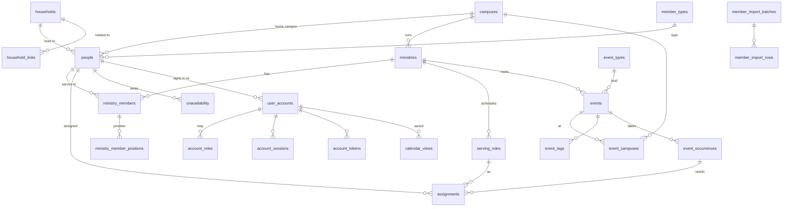

# Church portal databases (redesign)

The portal keeps its records in two databases:

| Database | Engine | Holds | Trusted? |
| --- | --- | --- | --- |
| **Members** (`christlikeness_members`) | MySQL / MariaDB | People, households, ministries, the calendar and serving schedule, logins | Yes: every row has been entered or reviewed by the church |
| **Visitors** (`storage/private/database/visitors.sqlite`) | SQLite | Guest sign-ups, visitor registrations, RSVPs | No: anyone can create these rows until a person reviews them |

A reviewed visitor is **promoted**: a person is created or matched in the
member database, and `visitor_promotions` records which person.

The redesign replaces the ChurchCRM-derived schema (`person_per`,
`family_fam`, `group_grp`, `person2group2role_p2g2r`, …) and the portal's
second database (`portal_users`, `christlikeness_people_tbl`, …). Nothing in
the application uses the new schema yet. The legacy databases are only read,
never changed.

## Files

| Path | What it is |
| --- | --- |
| `members/001_schema.sql` | Member database: 30 tables |
| `members/002_sheet_views.sql` | Views in the shape of the church's spreadsheet (see below) |
| `visitors/001_schema.sql` | Visitors database: 4 tables |
| `migrate/members_from_legacy.sql` | Copies the legacy records into the member database |
| `migrate/run.sh` | Recreates the member database, copies records, runs the verification |
| `migrate/household_links_from_json.php` | Turns the related-families file into `household_links` rows |
| `migrate/visitors_from_legacy.php` | Builds the visitors SQLite file from the legacy sign-up tables |
| `verify/members.sql` | Legacy vs new counts, and a list of records to review |

## Build

```sh
# Member database: drops and recreates christlikeness_members only.
MYSQL="sudo -n mysql" database/migrate/run.sh \
  christlikeness_members u471078694_churchcrm_v0 u471078694_christlike_mdb

# Visitors database (reads the legacy DB and member_types from the new one).
sudo -n php database/migrate/visitors_from_legacy.php --replace
```

`MYSQL` is any mysql client command line. For a server where the root socket
is not available, pass a client config file instead of a password on the
command line (`mysql --defaults-extra-file=…`). The visitors script reads
`LEGACY_DSN`, `LEGACY_USER`, `LEGACY_PASSWORD`, `LEGACY_DB` and `MEMBERS_DB`.

To migrate the latest production records, restore a dump of both production
databases under their own names on a local server, then run the same two
commands.

## Member database



Tables are grouped in the schema file the way they are here.

| Group | Tables |
| --- | --- |
| Organisation | `campuses`, `member_types`, `membership_statuses`, `household_roles`, `ministries`, `serving_roles` |
| People | `households`, `household_links`, `people`, `ministry_members`, `ministry_member_positions` |
| Calendar and serving schedule | `event_types`, `events`, `event_campuses`, `event_tags`, `event_occurrences`, `assignments`, `rosters`, `roster_slots`, `roster_assignments`, `unavailability` |
| Accounts | `user_accounts`, `account_roles`, `account_sessions`, `account_tokens`, `calendar_views` |
| Import, history, settings | `member_import_batches`, `member_import_rows`, `audit_log`, `settings` |

### Decisions

- **Ministries only, no generic groups.** Every legacy group was a ministry
  except the test group *CrisTest* (id 16), kept inactive because an account
  role refers to it.
- **No volunteer model.** A member serves in a ministry (`ministry_members`,
  role `member` or `leader`). The schedule assigns those people to that
  ministry's `serving_roles` on an `event_occurrence`. The portal's separate
  `ministry_leaders` tags merge into `ministry_members.role`.
- **Positions** (`ministry_member_positions`) keep a member's part in a
  ministry as the church's workbook writes it ("Usher", "Emcee" in Guest
  Services). `config/ministry-catalog.json` lists each ministry's positions;
  the member import records them and the roster export writes them back. The
  36 existing rows came from `member_group_and_ministry_roles_tbl`. They are
  labels, not scheduling rules.
- **No custom person fields.** The ChurchCRM custom-field framework held one
  field, *Member Type* (Radical, Trailblazer, G&A), now `member_types`. A future
  field is a column added by a migration, not a runtime-defined field.
- **A household is the family record** the Families tab edits: name, email,
  home phone, address, map position, wedding date, newsletter choice, and
  `deactivated_on`. A person keeps their own address and phones as well, since
  someone can live apart from their family.
- **Related families are rows** (`household_links`: parents' and married
  child's families, extended family, same residence). The legacy portal kept
  them in `config/related-families.json`; `migrate/run.sh` reads that file
  (`RELATED_FAMILIES=` to point at production's copy).
- **One home campus per person** (`people.campus_id`). Every legacy person had
  at most one campus affiliation.
- **Membership statuses, household roles and member types are small tables**
  (`membership_statuses`, `household_roles`, `member_types`) because
  administrators edit those lists on the Options page. They replace the generic
  `list_lst`; ids are preserved.
- **An event is a series.** The recurrence rule is columns on `events`;
  `event_occurrences` are the dated instances, and `original_starts_at` keeps
  an instance's identity when it is moved. `source_app` + `external_id` let
  Oikonomia publish its schedules into the same calendar without id clashes.
- **Several logins may belong to one person** (`user_accounts.person_id` is not
  unique): the legacy data has role-test accounts for the same person.
- **Change notes become the audit log.** All 74 legacy notes were automatic
  "edited / added to group / photo" records.
- **Dropped as unused:** donations and pledges (0 rows), volunteer
  opportunities (0), person properties (5 definitions, assigned to nobody),
  attendance headcounts
  (12 rows, all zero, created automatically), attendance records (0), and the
  module-owned RSVP event list (`rsvp_events`, 0 rows: an RSVP is for a
  calendar event).
- **Legacy ids are preserved** for people, households, ministries, roles,
  events, occurrences, assignments and accounts, so links and printed
  references keep working. Sessions are not copied: people sign in again.

### The church's spreadsheet

`christlikeness_people_tbl`, `member_group_and_ministry_roles_tbl` and
`ministry_roles_tbl` mirrored the Excel file the church keeps, to import and
export it. They were copies with their own id numbering (sheet person 1 is
not person 1), so they drifted: the portal had a newer email or phone for two
people, and a membership (in the test ministry) the sheet lacked.

Their value is the **shape**, so the shape is kept as views over the real
tables:

| View | Replaces |
| --- | --- |
| `sheet_people` | `christlikeness_people_tbl` |
| `sheet_ministry_members` | `member_group_and_ministry_roles_tbl` (positions in `member_group_associations`) |
| `sheet_serving_roles` | `ministry_roles_tbl` |

Export reads the views. Import goes through `member_import_batches` /
`member_import_rows`, where a person reviews matches before anything changes.

## Visitors database

| Table | Replaces | Holds |
| --- | --- | --- |
| `visitor_registrations` | `people_signup_temp` | A sign-up or visitor record and its review status (`new → reviewed → promoted`, or `duplicate` / `rejected`) |
| `visitor_rsvps` | `rsvp_attendance` | An answer for one event date, from a visitor or a member |
| `visitor_promotions` | — | Which member-database person a registration became |
| `visitor_admin_access_codes` | `signup_admin_access` | Codes that open the sign-up and RSVP admin screens |

The legacy status `migrated` is now `promoted`. Member-database ids are stored
as plain numbers; SQLite cannot enforce a key into MySQL, so promotion code
must check the person exists.

## Migration result (local copy, 2026-09-17)

Every count matched (`verify/members.sql`): 253 people, 167 households, 15
ministries, 280 ministry members (20 leaders), 36 positions, 24 serving roles,
13 events, 400 occurrences, 48 assignments, 12 accounts, 16 account roles, 75
audit entries. Visitors: 20 registrations, 0 RSVPs, 3 access codes.

For a person to review (not errors):

- Four people have several logins (people 853, 908, 909, 957; 909 has four).
- Two logins have no person (`admin.portal@…`, `audit.unlinked@…`).
- *Church Admin* (person 1) has no campus.
- Two email addresses are each shared by two people (818/831, 800/855).
- Sheet person *Ralph Cantimbulan* is *Ralph Cantimbuhan* (809) in the portal.
- The one legacy event tag (*Music*) belonged to event 69, which no longer
  exists, so it was not copied.

The local databases are a copy. The latest member records are on the
production server; rerun both builds against a production dump before relying
on the result.
