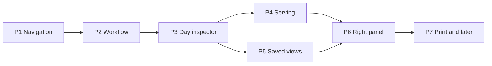

# Execution phases

Implementable packets for Claude, Cursor, and other agents. Product story: [32-product-usability-analysis.md](../32-product-usability-analysis.md). Capability statuses: [32-incomplete-capabilities.md](../32-incomplete-capabilities.md).

**Principle (repeat in every track):** Calendar → Activities → Ministries → People → Serving → Print are views of one church week, not new apps. Do not clone Planning Center. Do not add schema for rooms, RSVP merge, or relationship graphs. Do not rebuild print ([32-incomplete §5](../32-incomplete-capabilities.md)).



## Current state (2026-08-28)

Phases 1–6 have shipped, and `7a-publish-from-view` / `7b-unfilled-hint` landed in #27.
Each phase file carries a note saying what shipped and in which pull request; its
`status:` field says `shipped` rather than `ready`.

**Read the note at the top of a phase file before starting a track in it.** Phase 6's
"Before" described an inspector sitting in the main column and a right rail nobody used;
#27 moved it, and a track started from the old text would have redone the work.

Open: `7c-later-integrations` (planning only — [phase-07c](phase-07c-later-integrations.md)). Do not code 7c until a named row is unblocked.

## Parallelization rules

1. **One writer per file path per wave.** If two tracks list the same file, they are sequential.
2. **API contract before UI that consumes it.** Phase 3a must land (or freeze the JSON shape in the brief) before 3b.
3. **Copy/docs tracks never own PHP behavior files.**
4. **Do not parallelize `resources/views/calendar.php` with any other calendar.php track.**
5. **Default split:** Cursor on PHP/views/CSS/JS-in-PHP; Claude on in-app docs, IA copy, and reviewing diffs against 32.
6. **Blocked/deferred IDs** in 32-incomplete are out of scope until a human unblocks them.
7. **Tests:** every code track runs `node tests/Regression/source-contracts.mjs` plus any tests named in the phase file.

## Suggested waves

| Wave | Can run together | Wait for |
|---|---|---|
| Wave 1 | 1a, 1b, 1c | — |
| Wave 2 | 2a, 2b, 2c | Wave 1 merged (nav labels stable) |
| Wave 3a | 3a-day-api, 5a-view-model (docs of PrintConfig only) | Wave 2 |
| Wave 3b | 3b-inspector-ui **or** 5b-screen-views, not both on `calendar.php` at once | 3a contract |
| Wave 4 | 4a after 3a; 4b copy in parallel with 4a if files disjoint | 3a |
| Wave 5 | 6 after 3b + (4 or 5) | inspector exists |
| Wave 6 | 7a, 7b | 5 + 6 |
| — | 7c | Brief only. [phase-07c](phase-07c-later-integrations.md). Do not code until a named row is unblocked. |

## Phase files

| File | id |
|---|---|
| [phase-01-navigation.md](phase-01-navigation.md) | phase-01 |
| [phase-02-workflow.md](phase-02-workflow.md) | phase-02 |
| [phase-03-calendar-inspector.md](phase-03-calendar-inspector.md) | phase-03 |
| [phase-04-scheduling-workspace.md](phase-04-scheduling-workspace.md) | phase-04 |
| [phase-05-saved-views.md](phase-05-saved-views.md) | phase-05 |
| [phase-06-contextual-panels.md](phase-06-contextual-panels.md) | phase-06 |
| [phase-07-differentiators.md](phase-07-differentiators.md) | phase-07 (7a/7b shipped) |
| [phase-07c-later-integrations.md](phase-07c-later-integrations.md) | phase-07c (brief only; do not code) |

## Handoff snippet (paste at the top of an agent prompt)

```text
Read docs/design/32-product-usability-analysis.md (principle + your phase section).
Read docs/design/32-incomplete-capabilities.md (do not implement blocked/deferred/superseded).
Read docs/design/33-execution-phases/README.md (parallelization rules).
Then execute ONLY the track named below. Do not start other tracks. Do not edit files not listed for that track.
```
